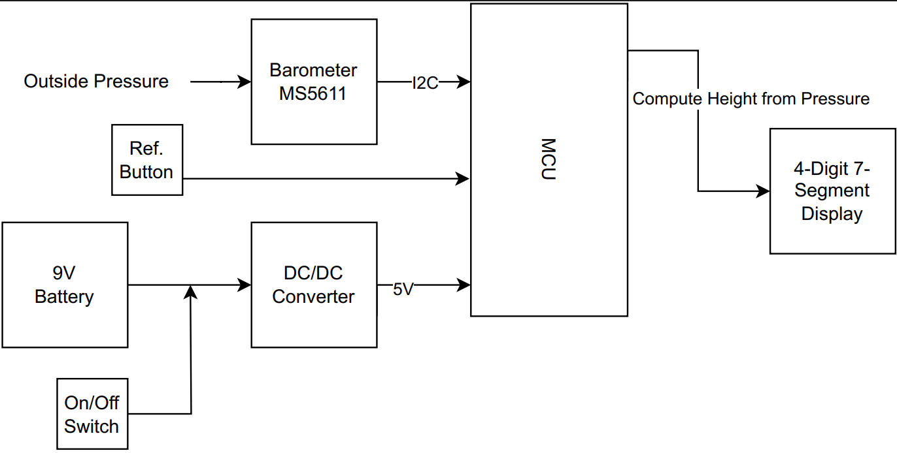
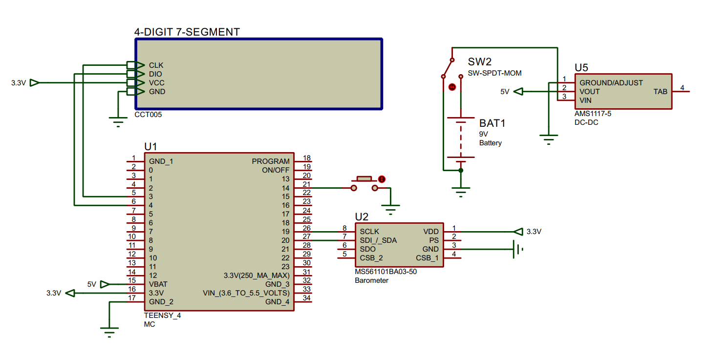

# Spacecraft Altimeter using Barometer
This repository is for a project conducted at the end of the "Spacecraft Electronics" Practical Lab Course. 

In the "resources" directory, one can easily find all the info about the project itself, both from the technical and non-technical side, including: 
1. Bill Of Materials
2. Gantt Chart
3. Block Functional Diagram
4. Schematics 
5. User Manual
6. Project Report

## Block Diagram of the Project

## Schematics 

## Altitude measurement 
There are two ways used in order to find the Altitude using the pressure and temprature readings from the device. 

In either formula: 

$$
\begin{align}
P_{0}=& \text{ reference pressure at sea level (1013.25hPa)}\\
P=& \text{ measured pressure (Pa) from the sensor}\\
h=& \text{ altitude (m)}
\end{align}
$$

### Hypsometric Formula

$$
h=\frac{\left( \left( \frac{P_{0}}{P}^{\frac{1}{5.2757}} \right)-1 \right)*(T+273.15)}{0.0065}
$$
### Barometric Formula 
$$
h=44330*(1-(P/P_0)^{\frac{1}{5.255}})
$$

## List of the Tests done to the Device

### Accuracy Test

Comparison of the barometer's readings with Sea level (or Bavaria Topology or Google Earth) or another reference barometer. Ensure that the readings are within an acceptable margin of error.
### Sensitivity Test

Exposure of the barometer to different pressure levels (device in lab available?) and observing its result. Testing what pressure level differences and altitude differences can be sensed.
### Temperature Compensation Test

Placement of the barometer in environments with different temperatures (outside and inside the lab). Checking that the barometer compensates for temperature changes to maintain accurate altitude measurements.
### Response Time Test

Changing the atmospheric pressure/altitude suddenly and measuring the time it takes for the barometer to stabilize and provide an accurate reading.
### Altitude Simulation Test

Changing the altitude and execute an observation how well the barometer adjusts to the different pressure (different floors of the lab). Check if the result corresponds to the expected altitude, which we measure with the Bosch Laser measurement device.
### Long-Term Stability Test

Leaving the barometer in a stable environment for a certain time (2 minutes) and periodically checking its results. Thereby, we test if the barometer maintains stable results over time.
### Power Supply Variation Test

Varying the power supply voltage within the specified operating range (3.3V – 5V) and checking that the altimeter’s results remain accurate.
Vibration and Shock Testing	Putting the altimeter on a vibrating surface and test if the altimeter can withstand mechanical stresses
### Communication Interface Test

Test the communication functionality of the I2C port to ensure reliable data exchange with the connected microcontroller.
