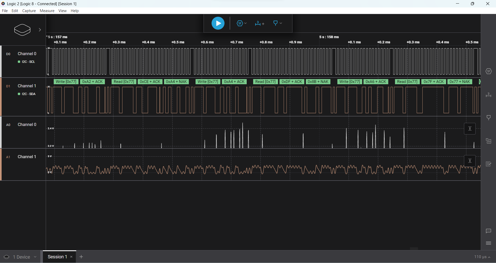

# Spacecraft Altimeter using Barometer
This repository is for a project conducted at the end of the "Spacecraft Electronics" Practical Lab Course. 

In the "resources" directory, one can easily find all the info about the project itself, both from the technical and non-technical side, including: 
1. Bill Of Materials
2. Gantt Chart
3. Block Functional Diagram
4. Schematics 
5. I2C Testing using Digital Analyzer
6. User Manual
7. Project Report

## Block Diagram of the Project

## Schematics 

## Altitude measurement 
There are two ways used in order to find the Altitude using the pressure and temprature readings from the device. 

In either formula: 

$$
\begin{align}
P_{0}=& \text{ reference pressure at sea level (1013.25hPa)}\\
P=& \text{ measured pressure (Pa) from the sensor}\\
h=& \text{ altitude (m)}
\end{align}
$$

### Hypsometric Formula

$$
h=\frac{\left( \left( \frac{P_{0}}{P}^{\frac{1}{5.2757}} \right)-1 \right)*(T+273.15)}{0.0065}
$$
### Barometric Formula 
$$
h=44330*(1-(P/P_0)^{\frac{1}{5.255}})
$$

### Accuracy and Precision  
In order to reduce the noise and stabilize the measured values from the sensor, we applied a digital filter. 

Digital filtering is a technique used to process and smooth out noisy sensor data in order to obtain a more stable and accurate signal. There are different types of digital filters, and the choice depends on the specific requirements of the application.  

## Moving Average Filter: 

- A moving average filter calculates the average of a set of recent data points to smooth out fluctuations in the signal. 
- The formula for a simple moving average is: 
$$ \text{Pressure}(n)=\frac{1}{N} \sum_{i=0}^{N-1}\text{Pressure}(n-i) $$ 
- N is the number of data points to include in the average. 

We then use the filtered pressure value to calculate the altitude, and to add an additional layer of filtering and smoothing out the altitude curve we used a Kalman filter for the altitude values.  

## Kalman Filter 

A Kalman filter is an advanced and versatile digital filtering technique that can be used for sensor fusion and state estimation. It is particularly effective in situations where there is both measurement noise and process noise. It is a recursive estimator. This means that only the estimated state from the previous time step and the current measurement are needed to compute the estimate for the current state. 

Image Ref: https://www.kalmanfilter.net/kalman1d.html
## Report
Can be found under ./resources
## Manual
Can be found under ./resources

## Interfacing with the Modules:

## MS5611 

Interfacing was done using I2C. All information about it can be found in the datasheet. 

### Seven Segment Display (TM1637)
The TM1637 is a Chinese made IC designed to drive up to 6 7-segment LEDs. It offers serial data input so that only 4 wires are need to connect to the display: POWER, GND, CLOCK and DATA. In fact it can also scan a keyboard matrix and return the key status to the controller. It can be found on integrated 4 digit displays available on eBay from Chinese sellers for a dollar or two. It follows on from the trend by MAXIM display chips serving similar functions. It's an attractive component if your microcontroller project needs a display and you don't want to use up lots of lines, drivers and resistors driving LED digits yourself, not to mention the coding of the multiplexing. A display board incorporating this controller costs only a little more than the displays on it.

## List of the Tests done to the Device

### Accuracy Test

Comparison of the barometer's readings with Sea level (or Bavaria Topology or Google Earth) or another reference barometer. Ensure that the readings are within an acceptable margin of error.
### Sensitivity Test

Exposure of the barometer to different pressure levels (device in lab available?) and observing its result. Testing what pressure level differences and altitude differences can be sensed.
### Temperature Compensation Test

Placement of the barometer in environments with different temperatures (outside and inside the lab). Checking that the barometer compensates for temperature changes to maintain accurate altitude measurements.
### Response Time Test

Changing the atmospheric pressure/altitude suddenly and measuring the time it takes for the barometer to stabilize and provide an accurate reading.
### Altitude Simulation Test

Changing the altitude and execute an observation how well the barometer adjusts to the different pressure (different floors of the lab). Check if the result corresponds to the expected altitude, which we measure with the Bosch Laser measurement device.
### Long-Term Stability Test

Leaving the barometer in a stable environment for a certain time (2 minutes) and periodically checking its results. Thereby, we test if the barometer maintains stable results over time.
### Power Supply Variation Test

Varying the power supply voltage within the specified operating range (3.3V – 5V) and checking that the altimeter’s results remain accurate.
Vibration and Shock Testing	Putting the altimeter on a vibrating surface and test if the altimeter can withstand mechanical stresses
### Communication Interface Test

Test the communication functionality of the I2C port to ensure reliable data exchange with the connected microcontroller.

## Resources and further reading:

- https://green-possum-today.blogspot.com/2018/10/a-comparison-of-tm1637-protocol-with.html
- https://www.kalmanfilter.net/kalman1d.html 
- https://en.wikipedia.org/wiki/Hypsometric_equation 
- https://en.wikipedia.org/wiki/Barometric_formula 
- https://www.saleae.com/downloads/ 
- https://www.te.com/commerce/DocumentDelivery/DDEController?Action=showdoc&DocId=Data+Sheet%7FMS5611-01BA03%7FB3%7Fpdf%7FEnglish%7FENG_DS_MS5611-01BA03_B3.pdf%7FCAT-BLPS0036
- https://en-gb.topographic-map.com/map-j7n9m/Bavaria/?center=48.0525%2C11.65572&zoom=16&popup=48.05311%2C11.65442